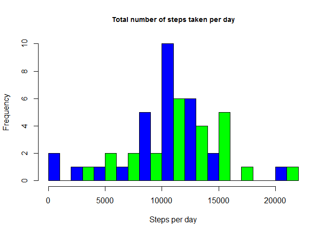
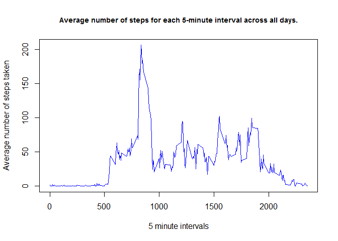
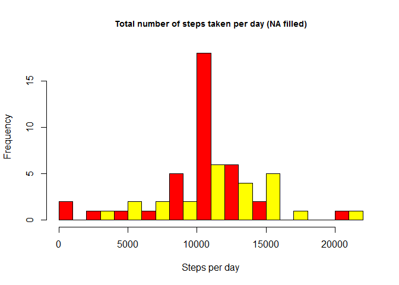
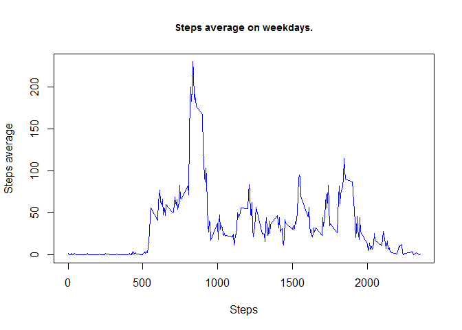
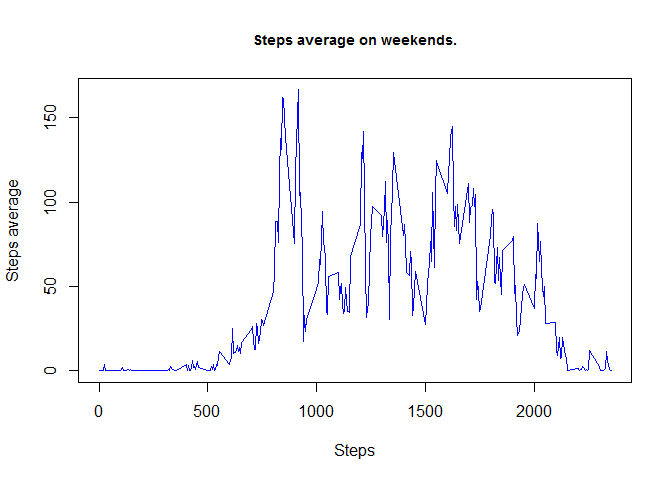

# Reproducible Research: Peer Assessment 1

Data Science Specialization, John Hopkins University |
Reproducible Research: Peer Assesment 1 |
Written by Gildardo Rojas Nandayapa 

## Summary

This assignment makes use of data from a personal activity monitoring device. This device collects data at 5 minute intervals through out the day. The data consists of two months of data from an anonymous individual collected during the months of October and November, 2012 and include the number of steps taken in 5 minute intervals each day.

## Loading and preprocessing the data

Data Science Specialization, John Hopkins University
Reproducible Research: Peer Assesment 1
Written by Gildardo Rojas Nandayapa

The source data can be downloaded here: [Activity Monitoring Data](https://d396qusza40orc.cloudfront.net/repdata%2Fdata%2Factivity.zip)

You can just unzip and place the activity.csv file into the working directory,
however the code to download and uncompress it is here:

1. Load the data (i.e. read.csv())

```r
## The use of download.file() causes a Knitr. The following instruction forces
## the use of internet2.dll fixing the mentioned error. Windows only!
setInternet2(TRUE)  
## Downloads the file
dataURL<-"https://d396qusza40orc.cloudfront.net/repdata%2Fdata%2Factivity.zip"
download.file(dataURL,"activity.zip",quiet=FALSE,cacheOK = TRUE)
## Concatenates the relative path (any working directory you are in) and the file.
filetounzip<-paste(getwd(),'/activity.zip',sep="")
unzip(filetounzip)
## Read the file an loads the working data set.
dsRaw <- read.csv("activity.csv")
```
2. Process/transform the data into a format suitable for analysis

```r
## Removes NA data
ds <- dsRaw[!is.na(dsRaw$steps),]
```

## What is mean total number of steps taken per day?
1. Make a histogram of the total number of steps taken each day

```r
ds2 <- aggregate(steps~date, data=ds, FUN="sum")
hist(ds2$steps,breaks=18,main="Total number of steps taken per day",
     xlab="Steps per day",col=c("blue","green"),cex.main=.9)
```

 
2. Calculate and report the mean and median total number of steps taken per day

```r
mean(ds2$steps)
```

```
## [1] 10766
```

```r
median(ds2$steps)
```

```
## [1] 10765
```
The mean is **10766**.
The median is **10765**. 

## What is the average daily activity pattern?

1. Make a time series plot (i.e. type = "l") of the 5-minute interval (x-axis) and the average number of steps taken, averaged across all days (y-axis)

```r
average <- sapply(split(ds$steps, ds$interval), mean, na.rm = T)
plot(names(average), average, type = "l", xlab = "5 minute intervals", 
    main="Average number of steps for each 5-minute interval across all days.",
    ylab = "Average number of steps taken",col="blue",cex.main=.9)
```

 

2. Which 5-minute interval, on average across all the days in the dataset, contains the maximum number of steps?

```r
## Calculates maximum average
maxAve<-max(average, na.rm=TRUE)
## Creates a data frame for results
ave = cbind(names(average),average)
maxAvSteps<-ave[average == maxAve]
```
The maximum interval is named **835**.
The maximum steps average is **206.1698**

## Imputing missing values

1. Calculate and report the total number of missing values in the dataset (i.e. the total number of rows with NAs)


```r
sum(is.na(dsRaw$steps))
```

```
## [1] 2304
```
The total number of rows with missing values is: **2304**


2. Devise a strategy for filling in all of the missing values in the dataset. The strategy does not need to be sophisticated. For example, you could use the mean/median for that day, or the mean for that 5-minute interval, etc.

There are many ways to do the same thing while programming, but I've noticed that in R there are even more. This way to fill the missing data might not be optimal in R language terms, but it works!

The NAs will be filled with average step values rounded (integers).

```r
dsFill <- dsRaw
na.before <- sum(is.na(dsFill$steps))
# Fill NA values using 'ave' matrix used in previous steps.
for(i in 1:nrow(dsFill)){
  if(is.na(dsFill[i,1]) == T){
    for(j in 1:nrow(ave)){
      if(ave[j,1] == dsFill$interval[i]){
        dsFill$steps[i] = as.integer(ave[j,2]) ## fill with integers
        j = nrow(ave)
      }
    }
  }
}
## If NAs were replaced, sum should now be zero
na.after <- sum(is.na(dsFill$steps))
```
As NAs have been replaced, dsFill had **2304** NA rows, now it has **0**.

3. Create a new dataset that is equal to the original dataset but with the missing data filled in.

The filled data set is **dsFill**, **dsNew** will contain the aggregations of steps per day. 

```r
dsNew <- aggregate(steps~date, data=dsFill, FUN="sum")
```

4. Make a histogram of the total number of steps taken each day and Calculate and report the mean and median total number of steps taken per day. Do these values differ from the estimates from the first part of the assignment? What is the impact of imputing missing data on the estimates of the total daily number of steps?

```r
hist(dsNew$steps,breaks=18,main="Total number of steps taken per day (NA filled)",
     xlab="Steps per day",col=c("red","yellow"),cex.main=.9)
```

 

```r
hist(ds2$steps,breaks=18,main="Total number of steps taken per day",
     xlab="Steps per day",col=c("blue","green"),cex.main=.9)
```

 

The histogram gets a "sharper", high values increase, while low values decrease, this due to adding averages instead of NA values. We can say it increases the contrast in the frequency.

## Are there differences in activity patterns between weekdays and weekends?

1. Create a new factor variable in the dataset with two levels - "weekday" and "weekend" indicating whether a given date is a weekday or weekend day.

```r
## IMPORTANT: Local is set to spanish, change "domingo" and "sábado" as needed.
week.f <- weekdays(as.Date(dsFill$date)) == "domingo" |
    weekdays(as.Date(dsFill$date)) == "sábado"
week.f <- factor(week.f, labels = c("weekday", "weekend"))
## Adding the factor to the dsFill data set
dsFill <- cbind(dsFill, week.f)
## A summary gives us a weekdays/weekend days proportion that looks good (5/2).
summary(dsFill$week.f)
```

```
## weekday weekend 
##   12960    4608
```

2. Make a panel plot containing a time series plot (i.e. type = "l") of the 5-minute interval (x-axis) and the average number of steps taken, averaged across all weekday days or weekend days (y-axis).


```r
avg.weekday <- aggregate(data=dsFill[week.f=="weekday",],steps~interval,
                         FUN="mean")
avg.weekend <- aggregate(data=dsFill[week.f=="weekend",],steps~interval,
                         FUN="mean")
## Plotting
plot(avg.weekday$interval, avg.weekday$steps, type="l", xlab="Steps", 
    main="Steps average on weekdays.", ylab ="Steps average",col="blue",
    cex.main=.9)
```

 

```r
plot(avg.weekend$interval, avg.weekend$steps, type="l", xlab="Steps", 
    main="Steps average on weekends.", ylab ="Steps average",col="blue",
    cex.main=.9)
```

 

**CONCLUSION**: From the plots, we can see people starts walking slightly later on weekends, we can also see that people walks more on weekends (see the peaks and overall higher averages), On weekdays many people seem not to walk a lot during business hours, look at the low values on the weekdays chart.
